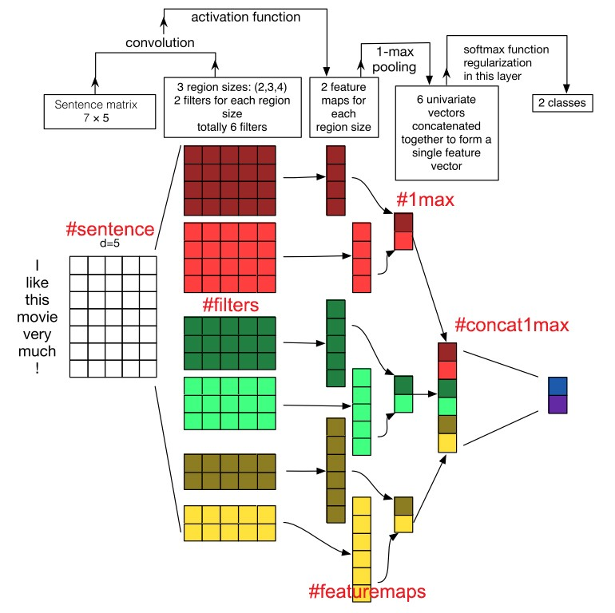
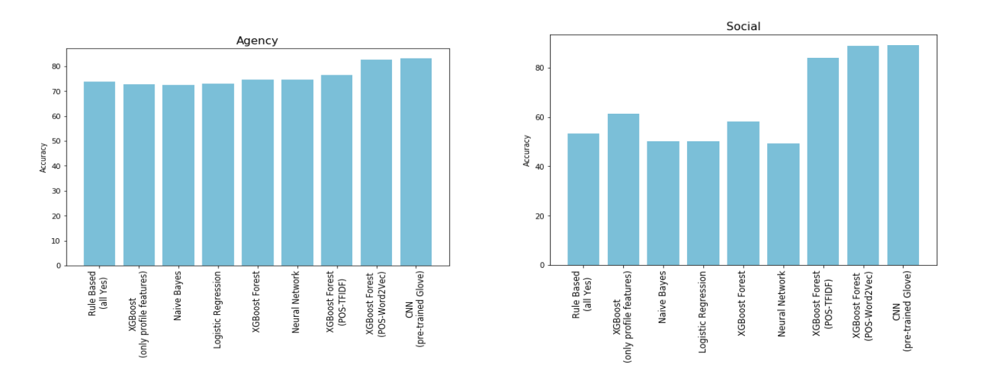

## __CL-AFF Shared Task : In Pursuit Of Happiness__

## Introduction

  The overall goal of the CL-Aff Shared Task is to understand what makes people happy, and the factors contributing towards such happy moments. Related work has centered around understanding and building lexicons that focus on emotional expressions , while Reed et al. learn lexico-functional linguistic patterns as reliable predictors for first-person affect, and constructed a First-Person Sentiment Corpus of positive and negative first-person sentences from blog journal entries. Wu et al. propose a synthetic categorization of different sources for well-being and happiness targeting the private micro-blogs in Echo, where users rate their daily events from 1 to 9. These work aim to identify specific compositional semantics that characterize the sentiment of events, and attempt to model happiness at a higher level of generalization, however finding generic characteristics for modeling well-being remains challenging. In this project, we aim to find generic characteristics shared between different affective  classification tasks. Our approach is to compare state-of-the-art methods for linguistic modeling to prior lexicons’ predictive power. While this body of work is broader in scope than the goals we are trying to address, they do include annotated sets of words associated with happiness as well as additional categories of psychological significance.

  The aim of this work is to address the two tasks that are part of the CL-Aff Shared Task. The data provided for this task comes from the HappyDB dataset. Task 1 focuses on binary prediction of two different labels, social and agency. The intention is to understand the context surrounding happy moments and potentially find factors associated with these two labels. Task 2 is fairly open-ended, leaving it to the participant’s imagination to model happiness and derive insights from their models. 

## Dataset

  HappyDB is a dataset of about 100,000 ‘happy moments’ crowd-sourced via Amazons Mechanical Turk where each worker was asked to describe in a complete sentence “what made them happy in the past 24 hours”. Each user was asked to describe three such moments. In particular, we exploit the agency and sociality annotations provided on the dataset as part of the recent CL-Aff shared task 2, associated with the AAAI-19 workshop of affective content analysis 3. For this particular shared task, 10,560 moments are labelled for agency and sociality and were available as labeled training data. 4 Then, there were 17,215
moments used as test data. Test labels were not released and teams were expected to submit the predictions based on their systems on the test split. For our models, we split the labeled data into 80% training set (8,448 moments) and 20% development set (2112 moments). We train our models on train and tune parameters on dev. For our system runs, we submit labels from the models trained only on the 8,448 training data points. The distribution of labeled data is as follows: agency (‘yes’=7,796; ‘no’= 2,764), sociality (‘yes’=5,625; ‘no’= 4,935).

## Methodology

### Model 1:
We started using the Profile features [Meta-data of a happy moment such as age, category, gender etc., etc.,] without considering the actual moment. This model is an attempt to understand if everything conveyed in the moment has been captured and would it suffice to predict the accuracy of social & agency. If the profile features are sufficient to predict social & agencies then we may get rid of the complexities involved in text understanding & rather focus on generating/capturing the profile features.

| Preprocessing       | LABEL ENCODING  
| Features            | Profile Features  
| Classifier          | XGBoost  
| Social Accuracy     |  61.2%  
| Agency Accuracy     | 72.83%  

#### Conclusion & Insights:
  Profile features alone are not sufficient to build the model & we need to consider the moments data. However, profile features may act well to support the model built on moments data. We may use, model built on profile features as a complementary model i.e. an ensemble model can be built with profile features model as one of them.

### Model 2
  Text (moment) based feature engineering. As an exploratory analysis we initially adopted one of the approach suggested by one of the state of the art papers i.e. to use 4grams to build features. We do not have any intuition behind the same, however did this as an exploratory learning experiment. Below are the results wrt the same.

| Model                  | Preprocessing     | Features | Feature \-Representation | Social | Agency |
|------------------------|-------------------|------------------------------------ |--------|--------|
| Naive    Bayes         | Stopword + Stem   | 4-Grams  |      TFIDF               | 50.19% | 72.54% |
| Logistic Regres.       | Stopword + Stem   | 4-Grams  |      TFIDF               | 50%   | 72.92% |
| XGBoost Forest         | Stopword + Stem   | 4-Grams  |      TFIDF               | 58%   | 74.59% |
| Neural Network         | Stopword + Stem   | 4-Grams  |      TFIDF               | 49.19%| 74.61% |

#### Conclusion & Insights:
We could not deduce anything definite from the experiment. However, we doubt if 4 grams is a good representation of a happy moment as with varied classifiers there is not much difference in the accuracy of the models. Also, they are either less or closer to the baseline accuracies.

### Model 3:
In this attempt we opted for a bottom up approach i.e. to study the data and come up with an approach to define the right set of features.

| Model                  | Preprocessing     | Features | Feature \-Representation                     | Social | Agency |
|------------------------|-------------------|---------------------------------------------------------|--------|--------|
| XGBoost Forest         | POS Tagging       | 4-Grams  | Noun Phrases                                 | 50.19% | 72.54% |
| XGBoost Forest         | POS Tagging       | 4-Grams  | All except verbs, punct, adjectives & adverbs| 50%   | 72.92% |
| XGBoost Forest         | POS Tagging       | 4-Grams  | All except adjectives & adverbs              | 58%   | 74.59% |

### Model 4[Deep Learning Models]:

  This classification model works on deep learning classifier, Convolutional Neural Network. The model implementation details are as follows: 

Data Preprocessing:

1. Split the sentences into word lists and omit all punctuation 	marks.Sentences are processed one by one into arrays of words. All punctuations, including comma, period, exclamation mark, question 	mark and so on, are discarded. A special case is that all 	abbreviations, like I’m, and we’re, remain unchanged. Stop words 	are also removed. 	
2. Transformed the sentences into sequences and pad them so that they are of the same length.
3. The agency and social labels were converted to binary vectors for 	training and validation purpose.

Split of the data set into a 3:1 ratio for training and testing has been done.

During training mini-batch gradient descent with batch size 32 and Adam optimizer is used with a learning rate of 0.1. The loss function used is binary cross entropy. 

The results are as follows: 
( Average Accuracy over 10 epochs )
We have tried with different word embeddings for CNN. Pre-trained glove provided better results than the glove trained on the corpus as the corpus is small sized.Below is the comparision of different embeddings:

| Model                  | Embeddings                 | Social | Agency   |
|------------------------|----------------------------|-------------------|
| CNN                    | Randomly initialized       | 88.46% | 82.177%  |
| CNN                    | Pre-Trained GloVe          | 89%   | 83.08%   |
| CNN                    | GloVe trained on Corpus    | 80.6% | 81.065%  |

## Conclusions:

1.  N-grams may not be the right feature engineering for this task.(Our customized features with ngrams did not enhance the performance of the models)
2.  Emotional features may not add any value towards the accuracy of both the classifications.
3.  Preprocessing such as stopword removal, stemming should not be done. In fact, in agency classification, it is observed that even punctuations add to the model’s performance.
4.  POS tagging with customized selection of words using tags worked the best for us. (Inclusion of ‘verbs’ for Agency classification increased the accuracy by 0.03%

## Task 2 Conclusions:
One of the factors that can help modeling happiness can be “Achievements: A moment that makes one feel better about themselves” Social Service etc., can be under the same bucket.

## Complete Report

The complete report can be found [here](https://drive.google.com/file/d/1S8xeRiZ78x_hQ2U8dZIU-tvDi89BIxxU/view?usp=sharing).

## Video Presentation

<iframe width="560" height="315" src="https://www.youtube.com/watch?v=UX9tsxTc7IM" frameborder="0" allow="accelerometer; autoplay; encrypted-media; gyroscope; picture-in-picture" allowfullscreen></iframe>

__Video Link__ : [here](https://www.youtube.com/watch?v=UX9tsxTc7IM).

__GITHUB LINK__: https://github.com/DeepthiKarnam00/InPursuitOfHappiness
